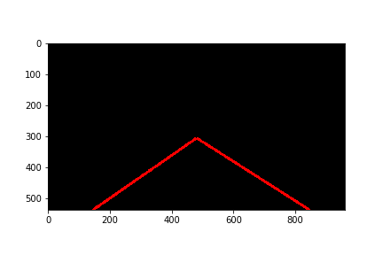

# **Finding Lane Lines on the Road** 

**Final output videos:**

Overview
---

When we drive, we use our eyes to decide where to go.  The lines
on the road that show us where the lanes are act as our constant reference for
where to steer the vehicle.  Naturally, one of the first things we would like to
do in developing a self-driving car is to automatically detect lane lines using
an algorithm.

In this project you will detect lane lines in images using Python
and OpenCV.  OpenCV means "Open-Source Computer Vision", which is a package that
has many useful tools for analyzing images.  

In this project, P1.Ipynb contains the project code, which needs to be opened with Jupyter notebook.

The Project
---

##  Deployment
If you have already installed the [CarND Term1 Starter
Kit](https://github.com/GuoliangPeng/CarND-Term1-Starter-Kit/blob/master/README.md)
you should be good to go!   If not, you should install the starter kit to get
started on this project. ##

**Step 1:** Set up the [CarND Term1 Starter
Kit](https://github.com/GuoliangPeng/CarND-Term1-Starter-Kit/blob/master/README.md)
if you haven't already.

**Step 2:** Open the code in a Jupyter Notebook

We
will complete the project code in a Jupyter notebook.  If you are unfamiliar
with Jupyter Notebooks, check out [Udacity's free course on Anaconda and Jupyter
Notebooks](https://classroom.udacity.com/courses/ud1111) to get started.
Jupyter
is an Ipython notebook where you can run blocks of code and see results
interactively.  All the code for this project is contained in a Jupyter
notebook. To start Jupyter in your browser, use terminal to navigate to your
project directory and then run the following command at the terminal prompt (be
sure you've activated your Python 3 carnd-term1 environment as described in the
[CarND Term1 Starter Kit](https://github.com/GuoliangPeng/CarND-Term1-Starter-Kit/blob/master/README.md) installation instructions!):

`> jupyter notebook`

A browser window will appear showing the contents of the current directory.  Click
on the file called "P1.ipynb".  Another browser window will appear displaying
the notebook.  Follow the instructions in the notebook to complete the project.

## Algorithm ideas

**Finding Lane Lines on the Road**
 The goals / steps of this project are the following: 
* Make a pipeline
that finds lane lines on the road      
* Reflect on my work in a written
report
--- 

### 1. Describe my pipeline. 
 **As part of
thedescription, explain how I modified the draw_lines() function.**  
 我的管道包括5个步骤:   
 1.我将原始三通道图像转换成单通道灰度图像： 

 2.将灰度图像进行高斯滤波处理,使用canny算法检测图像中的边缘信息: 

 3.在感兴趣区域内通过霍夫变换对边缘点提取直线线段信息，标记出车道线: 

 4.将标记出的车道线叠加到原始图像中: 

 5.改进第3步标记车道线函数，对检测到的车道线进行平均和外推，用整条实线标记出完整车道线并叠加到原始图像中: 

 在`draw_lines()`函数中，使用了最小二乘法拟合直线，并限制拟合直线斜率。 

### 2. Identify potential
 **shortcomings with my current pipeline:**   
*    一个潜在的缺点是在第5步中，使用最小二乘法拟合直线时在solidYellowLeft.mp4视频中有两帧图像拟合不准确，所以只能通过限制最小斜
     率范围达到准确识别效果
*    另一个缺点是此检测和拟合算法在相机颠簸的情况下拟合出来的直线左右抖动明显  
*    此算法不适用于弯道车道线标记  
  
  
### 3.Suggest
 **possible improvements to my pipeline:**   
*    一个可能的改进方式是：以线段的长度做加权平均来替代最小二乘法拟合直线 
*    或者用其他方法来检测并拟合车道线

